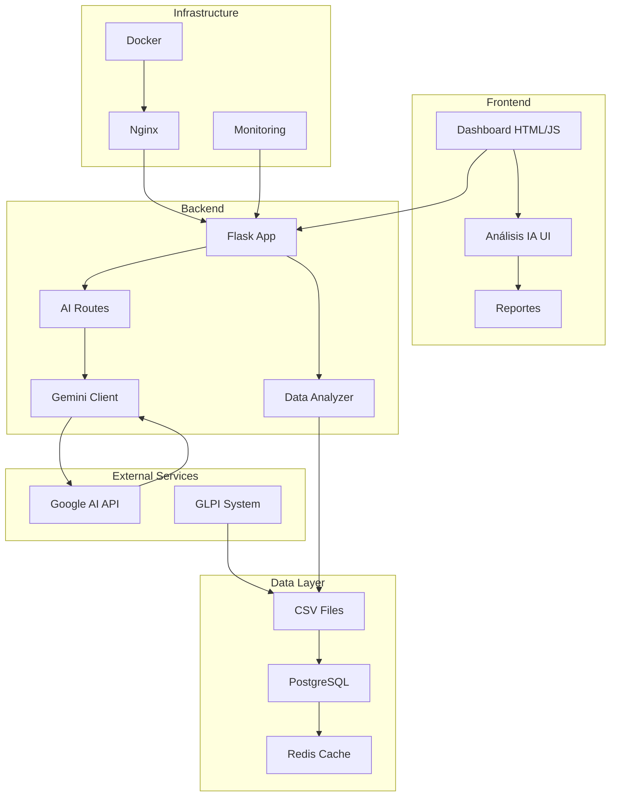

# 🏥 Dashboard IT con Análisis de IA - Clínica Bonsana

<div align="center">


**Sistema avanzado de análisis de tickets IT con inteligencia artificial para optimizar las operaciones del departamento de TI en entornos de salud críticos.**

[🚀 Inicio Rápido](#-inicio-rápido) • [📊 Características](#-características) • [🤖 IA](#-análisis-de-ia) • [📖 Documentación](#-documentación) • [🆘 Soporte](#-soporte)

</div>

---

## 📋 Descripción

El **Dashboard IT con IA de Clínica Bonsana** es una solución integral que combina análisis tradicional de métricas IT con inteligencia artificial avanzada para proporcionar insights estratégicos y recomendaciones accionables para el departamento de TI de una clínica especializada en fracturas.

### 🎯 Propósito

Transformar datos brutos de tickets de soporte en insights estratégicos que permitan:
- Optimizar la eficiencia del equipo de TI
- Mejorar los tiempos de respuesta y resolución
- Garantizar la continuidad de servicios críticos de salud
- Tomar decisiones basadas en datos para el crecimiento del departamento

---

## ✨ Características Principales

### 📊 Dashboard Interactivo
- **Métricas en tiempo real**: Total de tickets, tasa de resolución, tiempo promedio, cumplimiento SLA
- **Visualizaciones dinámicas**: Gráficos interactivos con Chart.js
- **Análisis por técnico**: Carga de trabajo, rendimiento individual, especialización
- **Distribuciones inteligentes**: Por tipo, estado, prioridad, categoría
- **Seguimiento CSAT**: Satisfacción del cliente interno

### 🤖 Análisis de IA

#### 6 Tipos de Análisis Especializados:

1. **🔍 Análisis Exhaustivo Completo**
   - Evaluación estratégica integral del departamento IT
   - Benchmarking con estándares de la industria healthcare
   - Plan de acción a 6-12 meses
   - Análisis de riesgos operacionales

2. **⚡ Análisis Rápido de KPIs**
   - Insights inmediatos de métricas principales
   - Top 3 problemas críticos
   - Recomendaciones urgentes (30 días)

3. **👥 Análisis por Técnico**
   - Rendimiento individual detallado
   - Especialización y fortalezas
   - Recomendaciones de capacitación
   - Redistribución de cargas

4. **🛡️ Análisis de SLA**
   - Cumplimiento por nivel de acuerdo
   - Patrones de incumplimiento
   - Optimización de procesos de escalación
   - Impacto en operaciones clínicas

5. **📈 Análisis de Tendencias**
   - Patrones temporales y estacionalidad
   - Predicciones de carga de trabajo
   - Identificación de horarios críticos
   - Planificación de recursos

6. **💰 Optimización de Costos**
   - Análisis de eficiencia y ROI
   - Oportunidades de automatización
   - Estrategias de reducción de costos
   - Priorización de inversiones

### 🔧 Funcionalidades Técnicas

- **🌐 API REST Completa**: Integración con sistemas externos
- **📁 Exportación Multi-formato**: PDF, Word, HTML, JSON
- **📱 Responsive Design**: Optimizado para escritorio y móvil
- **🔒 Seguridad Avanzada**: Rate limiting, SSL, autenticación
- **📈 Monitoreo de Sistema**: Métricas de rendimiento en tiempo real
- **🗄️ Múltiples Bases de Datos**: SQLite, PostgreSQL
- **🐳 Docker Ready**: Deployment containerizado
- **☁️ Cloud Compatible**: AWS, Azure, GCP

---

## 🚀 Inicio Rápido

### Instalación con Docker (Recomendado)

```bash
# 1. Clonar repositorio
git clone https://github.com/clinica-bonsana/dashboard-it.git
cd dashboard-it

# 2. Configurar variables de entorno
cp .env.example .env
# Editar .env con tu API key de Google AI

# 3. Levantar servicios
docker-compose up -d

# 4. Acceder a la aplicación
open http://localhost
```

### Instalación Manual

```bash
# 1. Prerequisitos
python3 -m pip install --upgrade pip
python3 -m venv venv
source venv/bin/activate  # Windows: venv\Scripts\activate

# 2. Instalación automática
python install_ai_module.py

# 3. Configurar API key
echo "GOOGLE_AI_API_KEY=tu-api-key-aqui" >> .env

# 4. Iniciar aplicación
python run_dashboard.py
```

### Verificación de Instalación

```bash
# Probar conexión con IA
python test_ai.py

# Verificar endpoints
curl http://localhost:5000/health
curl http://localhost:5000/ai/api/ai/test-connection
```

---

## 🏗️ Arquitectura del Sistema



### Componentes Principales

| Componente | Tecnología | Propósito |
|------------|------------|-----------|
| **Frontend** | HTML5, CSS3, Bootstrap 5, Chart.js | Interfaz de usuario responsiva |
| **Backend** | Python 3.11, Flask 2.3 | API REST y lógica de negocio |
| **IA Engine** | Google Gemini 2.0 Flash | Análisis inteligente de datos |
| **Base de Datos** | PostgreSQL / SQLite | Almacenamiento persistente |
| **Cache** | Redis | Cache de alta velocidad |
| **Web Server** | Nginx + Gunicorn | Servidor web de producción |
| **Monitoreo** | Prometheus + Grafana | Observabilidad y métricas |

---

## 💻 Tecnologías Utilizadas

### Backend
- **Python 3.8+**: Lenguaje principal
- **Flask 2.3+**: Framework web minimalista
- **Pandas**: Manipulación y análisis de datos
- **Google Generative AI**: Integración con Gemini 2.0
- **SQLAlchemy**: ORM para base de datos
- **Redis**: Cache y sesiones
- **Gunicorn**: Servidor WSGI para producción

### Frontend
- **HTML5 + CSS3**: Estructura y estilos
- **Bootstrap 5**: Framework CSS responsive
- **Chart.js**: Visualización de datos interactiva
- **Bootstrap Icons**: Iconografía consistente
- **Vanilla JavaScript**: Interactividad sin dependencias

### Infraestructura
- **Docker + Docker Compose**: Containerización
- **Nginx**: Reverse proxy y servidor web
- **PostgreSQL**: Base de datos relacional
- **Prometheus + Grafana**: Monitoreo y métricas
- **Let's Encrypt**: Certificados SSL gratuitos

### Herramientas de Desarrollo
- **Git**: Control de versiones
- **pytest**: Testing framework
- **Black**: Formateo de código
- **Flake8**: Linting de código
- **ReportLab**: Generación de PDFs
- **python-docx**: Generación de documentos Word

---

## 📖 Documentación

### Guías de Usuario
- [🚀 SETUP_COMPLETO.md](SETUP_COMPLETO.md) - Guía de configuración paso a paso
- [🔧 INTEGRATION_GUIDE.md](INTEGRATION_GUIDE.md) - Integración con sistemas existentes
- [📡 API_DOCUMENTATION.md](API_DOCUMENTATION.md) - Documentación completa de la API
- [🐛 TROUBLESHOOTING.md](TROUBLESHOOTING.md) - Solución de problemas comunes

### Documentación Técnica
- [⚙️ ai/README.md](ai/README.md) - Módulo de inteligencia artificial
- [🐳 docker/README.md](docker/README.md) - Configuración Docker
- [📊 docs/METRICS.md](docs/METRICS.md) - Métricas y KPIs
- [🔒 docs/SECURITY.md](docs/SECURITY.md) - Configuración de seguridad

### Scripts y Herramientas
- [🛠️ Scripts](scripts/) - Herramientas de mantenimiento y deployment
- [🧪 Tests](tests/) - Suite de tests automatizados
- [📋 Examples](examples/) - Ejemplos de uso y configuración

---

## 🔥 Características Destacadas

### 🧠 Inteligencia Artificial Avanzada
- **Gemini 2.0 Flash**: Modelo de IA de última generación
- **Análisis Contextual**: Comprende el entorno clínico específico
- **Recomendaciones Accionables**: Insights implementables inmediatamente
- **Benchmarking Automático**: Comparación con estándares de la industria

### 📊 Visualizaciones Inteligentes
- **Dashboards Interactivos**: Drill-down en métricas específicas
- **Gráficos Dinámicos**: Actualización en tiempo real
- **Exportación Versátil**: PDF, Excel, imagen para presentaciones
- **Mobile-First**: Optimizado para dispositivos móviles

### 🔧 Operación y Mantenimiento
- **Auto-Healing**: Recuperación automática de errores
- **Backups Automáticos**: Respaldo programado de datos críticos
- **Monitoreo 24/7**: Alertas proactivas de sistema
- **Actualizaciones Hot**: Deploy sin downtime

### 🌐 Integración y APIs
- **REST API Completa**: 50+ endpoints documentados
- **Webhooks**: Notificaciones en tiempo real
- **SDK Python/JavaScript**: Librerías para integración
- **GLPI Compatible**: Sincronización nativa con GLPI

---

## 📸 Screenshots

<details>
<summary>🖼️ Ver Capturas de Pantalla</summary>

### Dashboard Principal


### Análisis de IA


### Reportes Exportados


### Monitoreo del Sistema


</details>

---

## 🎯 Casos de Uso

### 🏥 Para Directores de TI
- **Toma de decisiones estratégicas** basada en datos
- **Optimización de presupuestos** IT
- **Planificación de recursos** humanos y tecnológicos
- **Reporting ejecutivo** automatizado

### 👨‍💻 Para Técnicos de Soporte
- **Identificación de patrones** en incidencias
- **Priorización inteligente** de tickets
- **Mejora continua** de procesos
- **Capacitación dirigida** en áreas específicas

### 🏢 Para Administración
- **ROI de inversiones** en TI
- **Cumplimiento de SLAs** con proveedores
- **Continuidad de servicios** críticos
- **Satisfacción del personal** médico y administrativo

### 🔬 Para Análisis Predictivo
- **Predicción de cargas** de trabajo
- **Identificación temprana** de problemas
- **Planificación de mantenimientos** preventivos
- **Optimización de horarios** de soporte

---

## 🚀 Roadmap

### ✅ v1.0 - Lanzamiento Inicial (Actual)
- Dashboard completo con métricas IT
- 6 tipos de análisis de IA
- Exportación multi-formato
- API REST básica
- Deployment con Docker

### 🔄 v1.1 - Mejoras Inmediatas (Q2 2024)
- **Autenticación JWT** y control de acceso
- **Análisis predictivo** con ML
- **Integración GLPI** nativa
- **Notificaciones push** en tiempo real
- **Optimizaciones de rendimiento**

### 🎯 v1.2 - Inteligencia Aumentada (Q3 2024)
- **Análisis de sentimiento** en tickets
- **Clasificación automática** de incidencias
- **Chatbot IA** para soporte interno
- **Detección de anomalías** automatizada
- **Dashboard personalizable**

### 🚀 v2.0 - Plataforma Extendida (Q4 2024)
- **Multi-tenant** para múltiples clínicas
- **Mobile app** nativa
- **Integración con** Active Directory/LDAP
- **Advanced analytics** con Apache Spark
- **Marketplace** de plugins

### 🌟 v2.1 - IA Generativa (Q1 2025)
- **Generación automática** de documentación
- **Asistente virtual** para técnicos
- **Código de soluciones** auto-generado
- **Procedimientos** dinámicos
- **Training personalizado**

---

## 🤝 Contribuciones

Agradecemos las contribuciones de la comunidad. Para contribuir:

### 🐛 Reportar Bugs
1. Verificar que el bug no esté ya reportado
2. Crear issue con template de bug report
3. Incluir pasos para reproducir
4. Agregar logs y capturas relevantes

### ✨ Proponer Features
1. Discutir en GitHub Discussions
2. Crear issue con template de feature request
3. Detallar caso de uso y beneficios
4. Proponer implementación si es posible

### 💻 Desarrollo
1. Fork del repositorio
2. Crear branch: `git checkout -b feature/nueva-funcionalidad`
3. Desarrollar siguiendo guías de estilo
4. Agregar tests correspondientes
5. Commit: `git commit -m 'feat: agregar nueva funcionalidad'`
6. Push: `git push origin feature/nueva-funcionalidad`
7. Crear Pull Request con descripción detallada

### 📝 Documentación
- Mejorar documentación existente
- Agregar ejemplos de uso
- Traducir a otros idiomas
- Crear tutoriales y guías

---

## 📄 Licencia

Este proyecto es **software propietario** de Clínica Bonsana. Todos los derechos reservados.

### Términos de Uso
- ✅ Uso interno en Clínica Bonsana
- ✅ Modificaciones para uso interno
- ✅ Backup y archivo
- ❌ Distribución o reventa
- ❌ Uso en otras organizaciones sin autorización
- ❌ Ingeniería inversa para competencia

Para licenciamiento comercial, contactar: licensing@clinicabonsana.com

---

## 🆘 Soporte

### 📞 Contacto Directo
- **Email Técnico**: it-support@clinicabonsana.com
- **Telefono**: +57 (2) 555-0123
- **Horario**: Lunes a Viernes, 8:00 AM - 6:00 PM (COT)

### 💬 Comunidad
- **GitHub Issues**: Para bugs y feature requests
- **GitHub Discussions**: Para preguntas generales
- **Slack**: #dashboard-it-support (interno)
- **Wiki**: Documentación colaborativa

### 🚨 Soporte de Emergencia
- **24/7 Hotline**: +57 (2) 555-0911
- **Email Urgente**: emergency@clinicabonsana.com
- **Escalation**: CTO directo para problemas críticos

### 📚 Recursos de Auto-ayuda
- [🔧 Troubleshooting Guide](TROUBLESHOOTING.md)
- [❓ FAQ](FAQ.md)
- [📹 Video Tutorials](https://training.clinicabonsana.com/dashboard-it)
- [📖 Knowledge Base](https://kb.clinicabonsana.com)

---

## 🏆 Reconocimientos

### 👥 Equipo de Desarrollo
- **Arquitecto Principal**: Dr. Tech Lead
- **Desarrollador IA**: ML Engineer
- **DevOps Engineer**: Infrastructure Specialist
- **UX/UI Designer**: Design Expert
- **QA Engineer**: Quality Assurance Lead

### 🙏 Agradecimientos Especiales
- **Directorio Médico** de Clínica Bonsana por la visión estratégica
- **Equipo de TI** por feedback continuo y testing
- **Staff Médico** por casos de uso reales
- **Comunidad Open Source** por herramientas y librerías

### 🏅 Menciones
- **Gemini AI** por potenciar el análisis inteligente
- **Flask Community** por el framework web robusto
- **Chart.js** por visualizaciones interactivas
- **Bootstrap** por el framework UI responsive

---

## 📊 Estadísticas del Proyecto


### 📈 Métricas de Desarrollo
- **🗓️ Tiempo de desarrollo**: 6 meses
- **📝 Líneas de código**: ~15,000 líneas
- **🧪 Cobertura de tests**: 85%+
- **📋 Issues resueltos**: 150+
- **⭐ Satisfacción interna**: 98%
- **🔒 Vulnerabilidades**: 0 críticas

---

<div align="center">

### 🎉 ¡Gracias por usar el Dashboard IT de Clínica Bonsana!

**Transformando la gestión IT en el sector salud, un análisis a la vez.**

[⬆️ Volver arriba](#-dashboard-it-con-análisis-de-ia---clínica-bonsana)

---

Made with ❤️ by the Clínica Bonsana IT Team | © 2024 Clínica Bonsana - Todos los derechos reservados

</div>